   # Vince's Vinyl Used Record Shop #                                                  
   ### Author: Wali Morris ### 

*This database is a simplified backend version of a retail shop selling vinyl records. Currently, this 
project doesn't include a frontend design.*

***Tools:*** *MySQL-Workbench, Python, Ubuntu 18.04*

***Overview:***
Vince’s Vinyl is a small shop that sells used vinyl records. Up until now, Vince, the owner, has kept
track of his sales and purchases in a spiral notebook. He priced things based on what he thought
they were worth, often though with only a vague memory of what he paid for them. He is
generous with discounts and sometimes over generous with purchases. His friends, worried that
he will not be able to continue to support his business in this manner, have convinced him to
commission a database to better track his purchases, inventory and sales.

***The Scope:***
The database is meant to manage all the store’s business as it relates to purchasing, storing and
selling vinyl records. It should manage all his purchases of albums, including who he bought them
from, when he bought them and how much he paid for it. It should contain an inventory of all the
albums in the store. The database should also handle all Point of Sale information.

In addition, customers can request items that are not in at the moment. The database should keep
a list of such requests and the contact information for the customers. Vince would also like to
keep a list of customers who are willing to give their name and emails so that he can notify them
of significant new purchases.

Vince’s Vinyl has two or three part time employees at any one time, who handle the shop while he
is away. They are allowed to sell albums, but must defer any purchases until Vince is in. The
database should track which employee is at the counter for each sale, but it will not be a human
resources database. That is, it will not contain information about their hours, salaries taxes, etc.

***Business Rules:***
* Each album inventoried as a seperate item
* Albums are rated by quality of vinyl and cover
  * Mint
  * Excellent
  * Good 
  * Fair 
  * Poor
* The base price for an album is 150% of the price Vince paid for it
* Vince must be free to lower or raise a price
* Customers who buy 10 albums within a year's time get a 25% discount 

Before populating Vincent's Vinyls: The logical design of the database was created with MySql-Workbench. 
Here's an ERD Representation of Vincent's database 

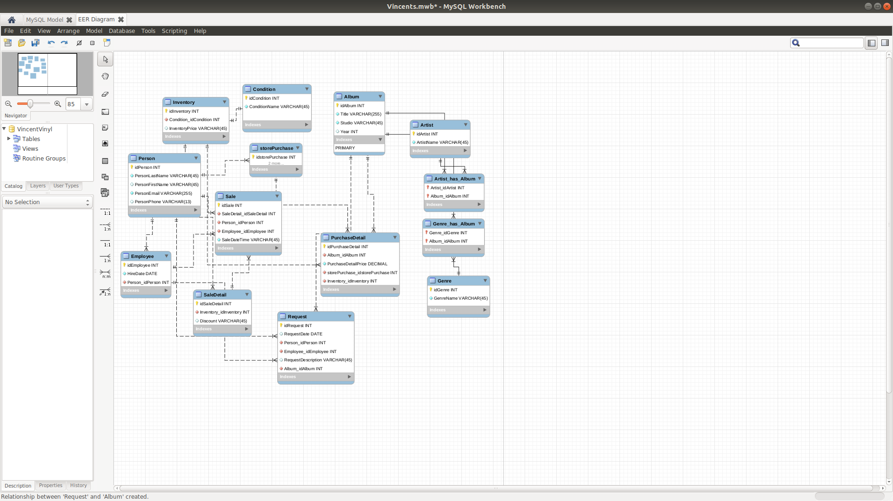

***A CLOSER LOOK and Sample Data:***

***Album Table***

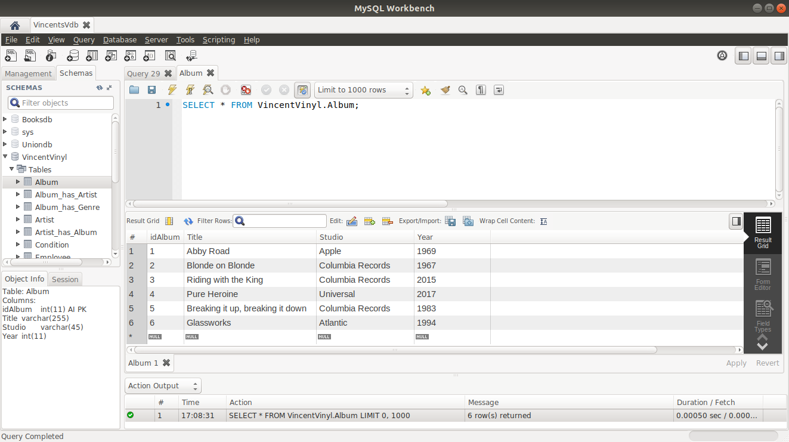

***Artist Table***

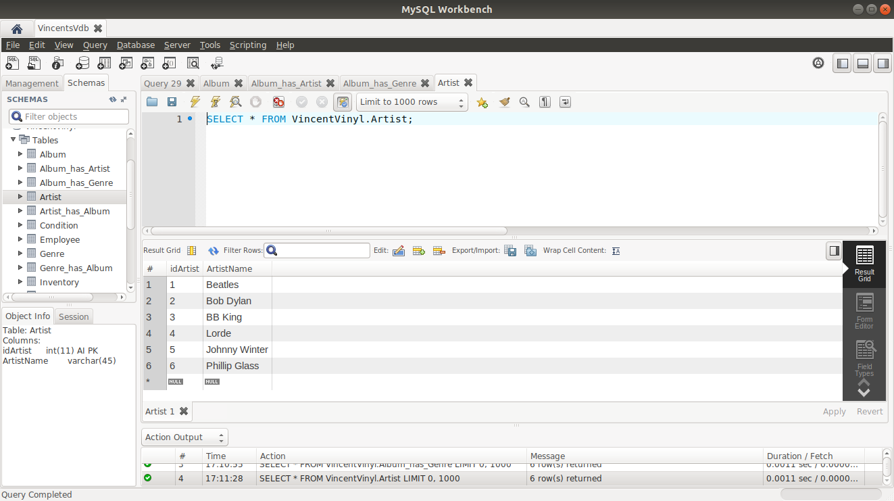

***Album_has_Artist Table***

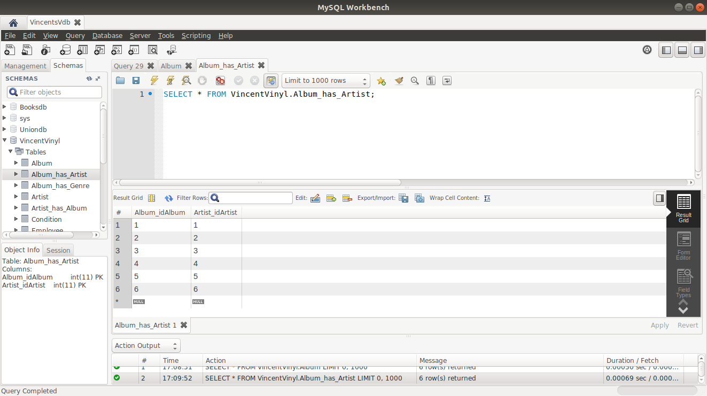

***Artist_has_Album Table***

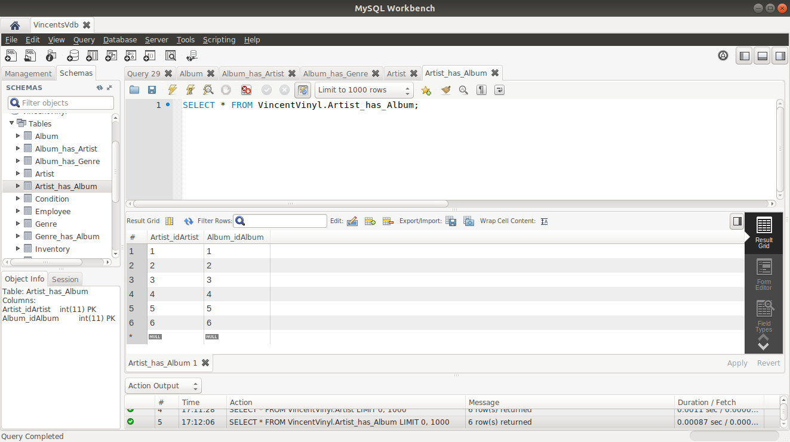

***Genre Table*** 

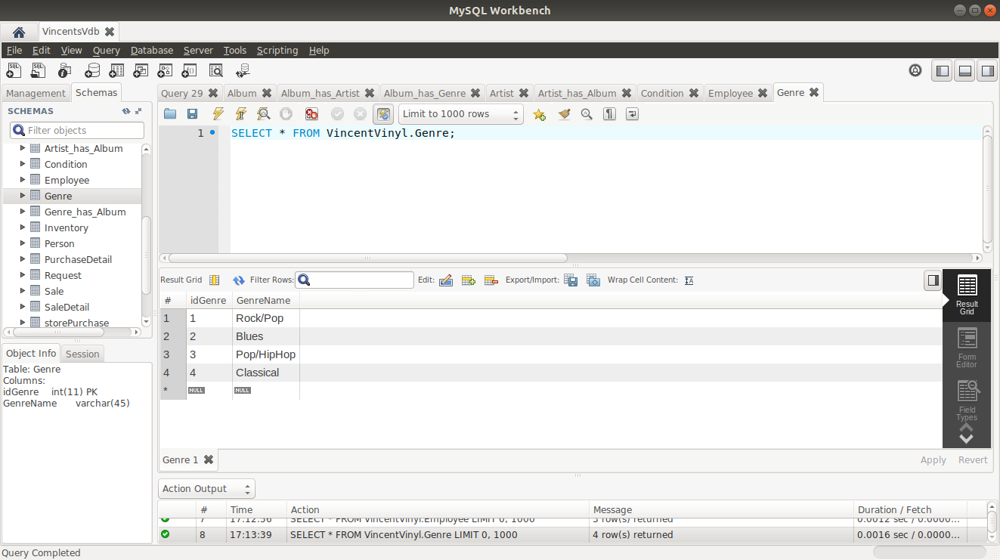

***Genre_has_Album Table***

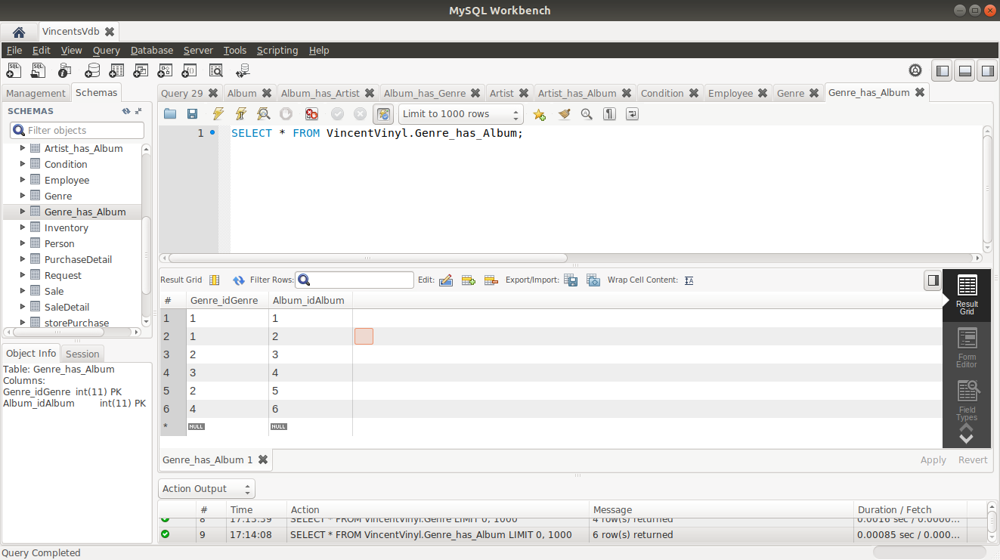

***Album_has_Genre Table***

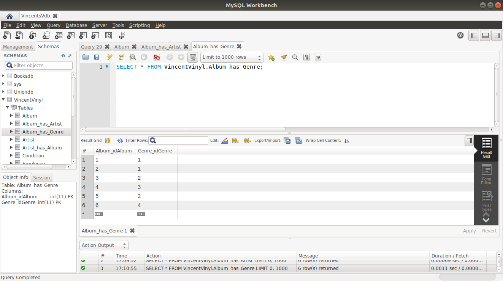

***Person Table***

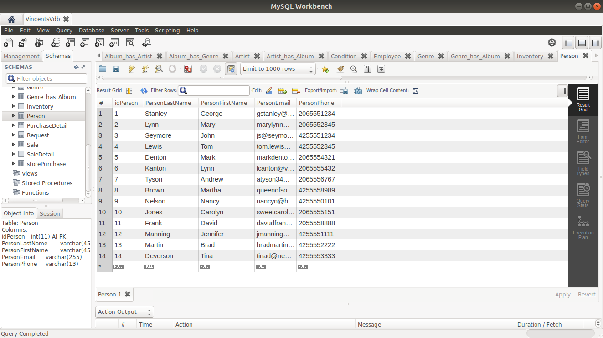

***Employee Table***

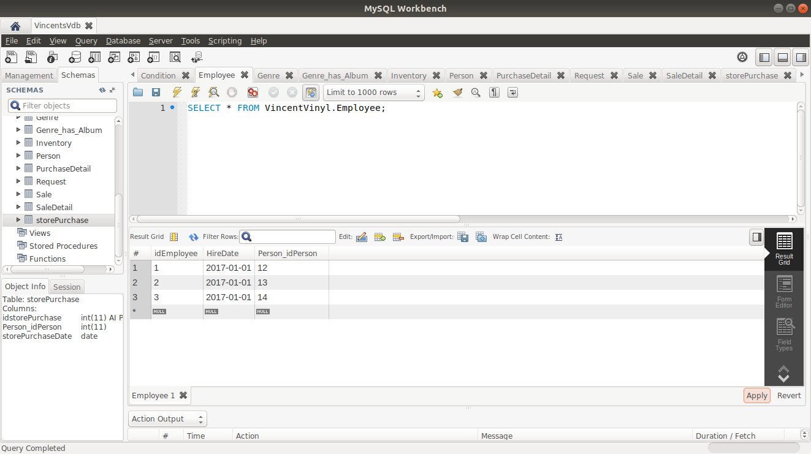

***Condition Table***

***Inventory Table***

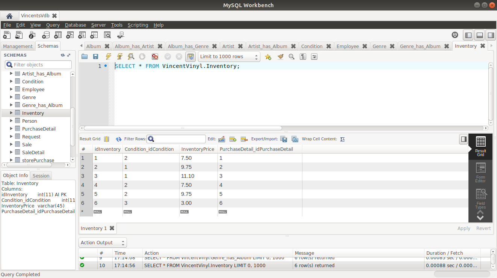

***Requests Table***

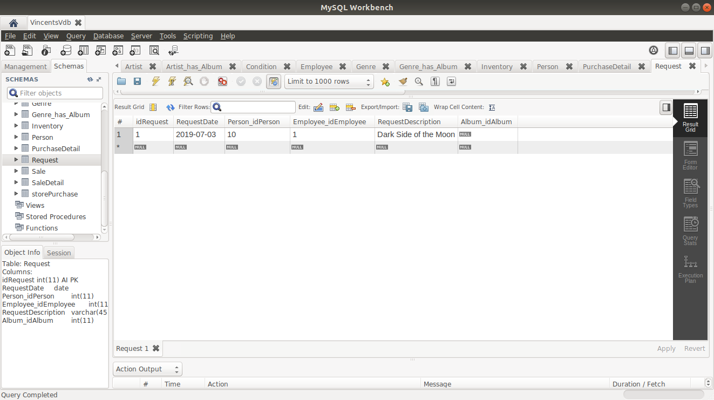

***Store Purchase Table***

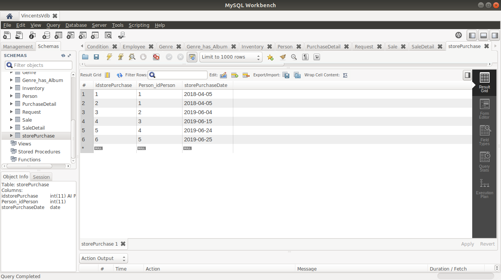

***Purchase Detail Table***

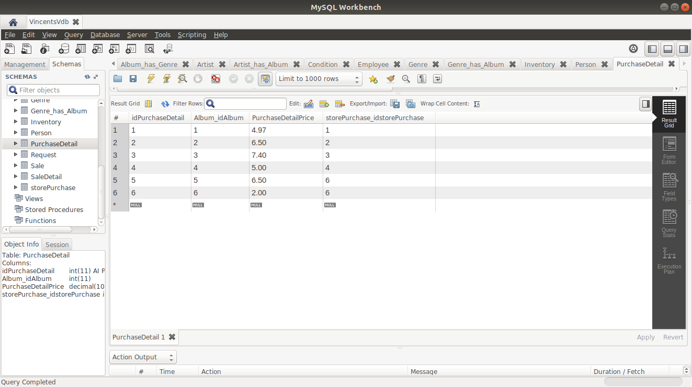

***Sales Table***

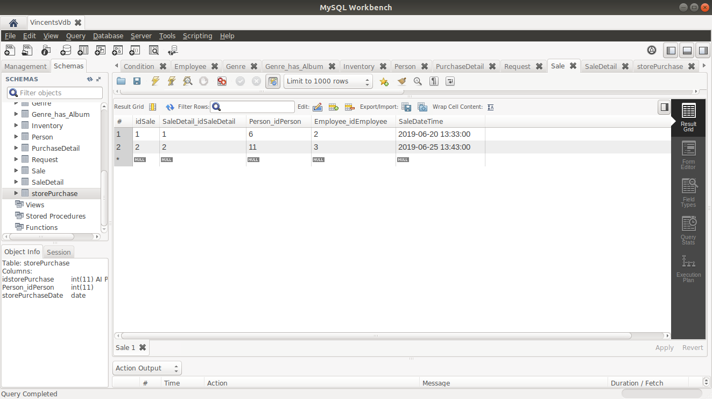

***Sales Detail Table***

