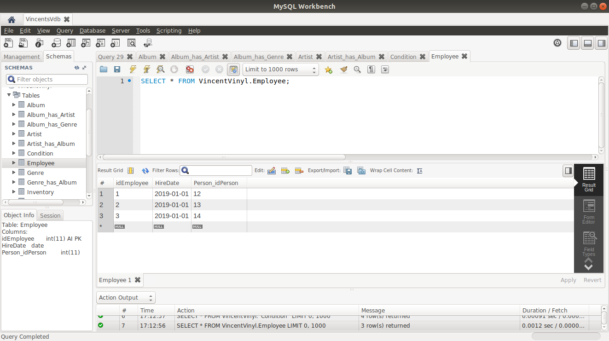
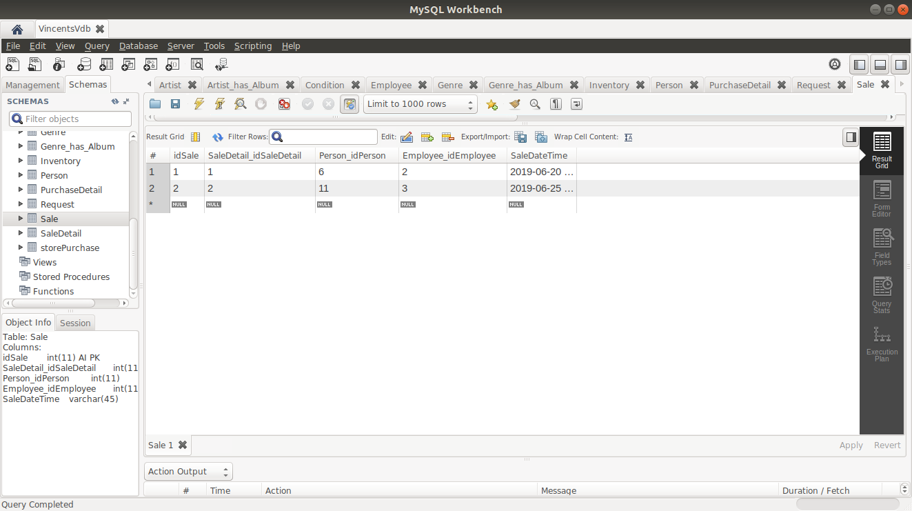

***Vince's Vinyl Used Record Shop*** 

Date: Feb 5, 2020

By: Wali Morris

*This database is a simplified backend version of a retail shop selling vinyl records. Currently, this 
project doesn't include a frontend design.*

***Tools:*** *MySQL-Workbench, Python, Ubuntu 18.04*

***Overview:***
Vince’s Vinyl is a small shop that sells used vinyl records. Up until now, Vince, the owner, has kept
track of his sales and purchases in a spiral notebook. He priced things based on what he thought
they were worth, often though with only a vague memory of what he paid for them. He is
generous with discounts and sometimes over generous with purchases. His friends, worried that
he will not be able to continue to support his business in this manner, have convinced him to
commission a database to better track his purchases, inventory and sales.

Before populating Vincent's Vinyls: The logical design of the database was created with MySql-Workbench. 
Here's an ERD Representation of Vincent's database 

**A CLOSER LOOK AT EACH TABLE:**

***Album Table***

***Artist Table***

***Album_has_Artist Table***

***Artist_has_Album Table***

***Genre Table*** 

***Genre_has_Album Table***

***Album_has_Genre Table***

***Person Table***

***Employee Table***

***Condition Table***

***Inventory Table***

***Requests Table***

***Store Purchase Table***

***Purchase Detail Table***

***Sales Table***

***Sales Detail Table***

